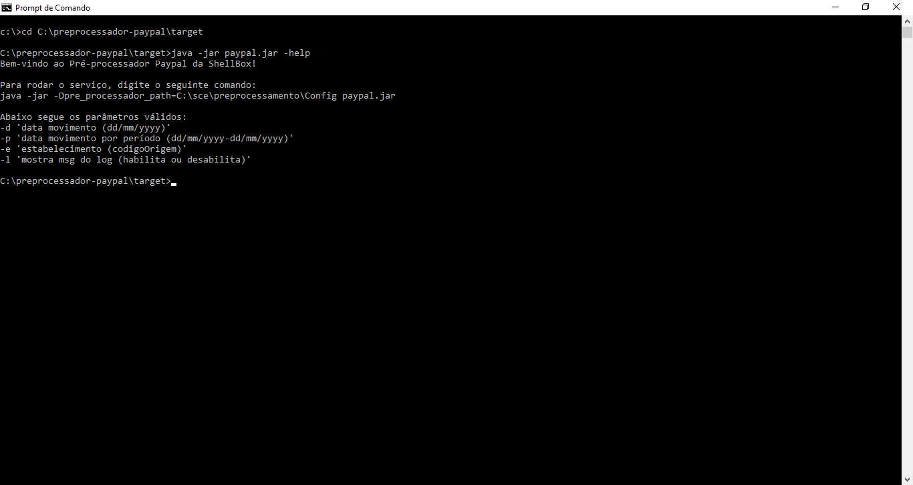

# Pre-Processador Paypal

Projeto desenvolvido em Java para a empresa Auttar.<br>
Construção de um Pré-Processador para captura de transações realizadas através da Paypal.<br>
O objetivo aqui é apenas mostrar o trabalho realizado na empresa.<br><br>

PS: Alguns dados foram ocultados por questões de privacidade.<br>

## Características

- API Paypal
- Interface
- DAO
- Bean
- Entidade
- Gravação de Logs

## Requisitos

- Java JDK 1.8
- Maven 3.5.4
- Oracle 12c
- IDE Eclipse
- Postman

## Tecnologias

- Java
- Hibernate
- Maven
- Jetty
- Json

## Instalação

```
$ git clone https://github.com/danilomeneghel/preprocessador-paypal.git

$ cd preprocessador-paypal
```
Após baixar o projeto, ir até a IDE do Eclipse em "Run/Run Configutations/Java Application/Main/Arguments" e colocar o seguinte comando:
-Dpre_processador_path=C:\sce\preprocessamento\Config

Depois é preciso mover a pasta "sce" para o C:\ e mudar as configurações do arquivo de conexão do seu banco de dados (db.properties).
Ou caso preferir, poderá colocar em outro diretório, bastando depois mudar a chamada desse diretório dentro do Eclipse.

## Repositório Maven

Localizar dependências do Maven. <br>
https://mvnrepository.com/

## Demonstração 

Para saber mais detalhes de como rodar o serviço, abra o seu terminal e vá até o diretório onde foi gerado seu arquivo jar.
Depois digite o seguinte comando:

```
$ java -jar paypal.jar -help
```

## Licença

Projeto licenciado sob <a href="LICENSE">The MIT License (MIT)</a>.

## Screenshots

<br><br>
<br><br>


Developed by<br>
Danilo Meneghel<br>
danilo.meneghel@gmail.com<br>
http://danilomeneghel.github.io/<br>
